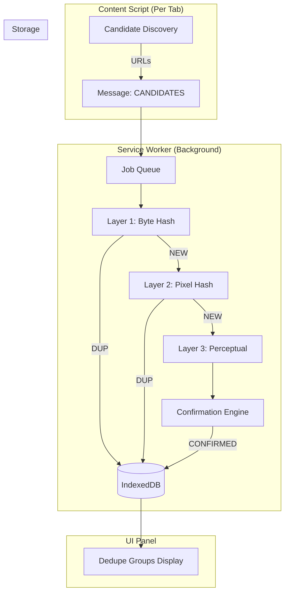
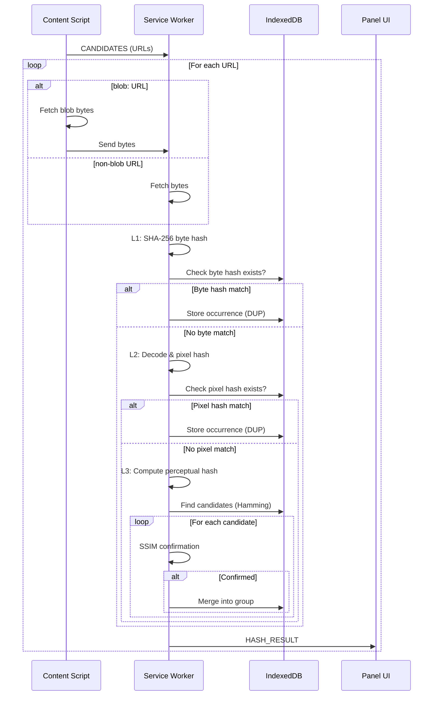

# Perfect Image Deduplication Plan

> **A comprehensive, multi-layered approach to image deduplication prioritizing accuracy over recall**

This plan merges three complementary deduplication strategies into a unified pipeline, ordered from fastest/cheapest to most thorough.

---

## Table of Contents

1. [Overview](#1-overview)
2. [Deduplication Layers](#2-deduplication-layers)
3. [Architecture](#3-architecture)
4. [Implementation Taskflow](#4-implementation-taskflow)
5. [Detailed TODO Checklist](#5-detailed-todo-checklist)
6. [Data Models](#6-data-models)
7. [Decision Policies](#7-decision-policies)
8. [Testing & Verification](#8-testing--verification)

---

## 1) Overview

### Goal
Deduplicate images **without ever removing unique images** by using a layered approach that progressively identifies duplicates from exact matches to visually similar images.

### Three Layers (in order of execution)

| Layer | Name | What It Detects | False Positive Risk |
|-------|------|-----------------|---------------------|
| **L1** | Exact Byte Hash | Identical file bytes | **Zero** |
| **L2** | Canonical Pixel Hash | Same pixels, different encoding | **Zero** (if canonicalization is consistent) |
| **L3** | Perceptual + Confirm | Visually similar (resized, recompressed) | **Minimal** (with strict SSIM confirmation, but non-zero) |

> [!IMPORTANT]
> **L1 and L2 guarantee zero false positives** (cryptographic hash matches only). **L3 has minimal but non-zero false positive risk** due to perceptual hashing; the strict SSIM confirmation (≥0.995) makes this extremely rare but not impossible. Always group, never auto-delete.

### Key Principle

> **Never delete automatically.** Group duplicates and let the user decide. Always keep an "undo" capability.

---

## 2) Deduplication Layers

### Layer 1: Exact Byte Hash (Fastest)

**Source:** [perfect-byte-image-dedupe-workflow.md](./perfect-byte-image-dedupe-workflow.md)

**What it does:**
- Fetches raw image bytes
- Computes SHA-256 hash
- Two images are duplicates **only if bytes are identical**

**Catches:**
- ✅ Exact copies
- ✅ Hotlinked/embedded same file
- ✅ CDN-served identical files

**Misses:**
- ❌ Same image saved with different encoder
- ❌ Same image with stripped/added metadata
- ❌ Resized or recompressed versions

**Implementation:**
```javascript
async function sha256Hex(arrayBuffer) {
  const hashBuf = await crypto.subtle.digest("SHA-256", arrayBuffer);
  const bytes = new Uint8Array(hashBuf);
  return [...bytes].map(b => b.toString(16).padStart(2, "0")).join("");
}
```

---

### Layer 2: Canonical Pixel Hash (Medium Cost)

**Source:** [canonical-pixel-hash-workflow.md](./canonical-pixel-hash-workflow.md)

**What it does:**
- Decodes image to pixels (RGBA)
- Applies canonicalization (orientation, alpha handling)
- Hashes the pixel buffer with SHA-256

**Catches:**
- ✅ Same pixels saved as PNG vs JPG
- ✅ Different encoders producing same visual output
- ✅ Metadata changes (EXIF stripped/added)
- ✅ Different chunk ordering

**Misses:**
- ❌ Resized images
- ❌ Cropped images
- ❌ Recompression that changes pixels (lossy)

**Canonicalization Contract:**
1. **Pixel format:** RGBA, 8-bit per channel, row-major
2. **Orientation:** Apply EXIF orientation (read EXIF and rotate/flip in canvas; not via `createImageBitmap`)
3. **Colorspace:** Treat as sRGB
4. **Alpha:** Use unpremultiplied alpha (via `premultiplyAlpha: "none"`)
5. **Hash structure:** `[4 bytes width][4 bytes height][RGBA bytes]`

---

### Layer 3: Perceptual Hash + Confirmation (Most Thorough)

**Source:** [perceptual-candidate-confirm-merged.md](./perceptual-candidate-confirm-merged.md)

**What it does:**
- Computes perceptual hash (dHash/pHash) for quick candidate discovery
- Uses conservative Hamming distance thresholds
- **Confirms** candidates with SSIM before marking as duplicates

**Catches:**
- ✅ Resized versions
- ✅ Different compression levels
- ✅ Format conversions (PNG/JPG/WebP)
- ✅ Minor color/contrast shifts
- ✅ Rotated versions (requires multi-rotation hashing + transform confirmation)

> [!NOTE]
> L3 has **minimal but non-zero** false positive risk. The strict SSIM confirmation (≥0.995) makes false positives extremely rare, but they cannot be completely ruled out. This is why we **group duplicates** instead of auto-deleting.

**Two-Stage Process:**

**Stage A: Candidate Discovery (Fast)**
- Compute dHash (64-bit) or pHash (64-bit)
- **For rotation detection:** hash the image at 0°, 90°, 180°, 270° orientations
  - Store all 4 hashes per image
  - Match if ANY orientation hash is within threshold
- Find candidates with Hamming distance ≤ threshold
- Conservative thresholds:
  - dHash: ≤ 4
  - pHash: ≤ 6

**Stage B: Confirmation (Strict)**
- Create canonical thumbnails (256×256 max)
- Try transforms: 0°, 90°, 180°, 270° rotations
- Compute SSIM score
- Accept only if **SSIM ≥ 0.995**

---

## 3) Architecture

### Component Diagram



### Data Flow



---

## 4) Implementation Taskflow

### Phase 1: Foundation (Week 1)

```
┌─────────────────────────────────────────────────────────────┐
│  PHASE 1: Core Infrastructure                               │
├─────────────────────────────────────────────────────────────┤
│  [ ] 1.1 IndexedDB Setup                                    │
│      [ ] Create database schema                             │
│      [ ] Implement CRUD operations                          │
│      [ ] Add migration support                              │
│                                                             │
│  [ ] 1.2 Job Queue System                                   │
│      [ ] Implement async queue with concurrency control     │
│      [ ] Add retry logic with exponential backoff           │
│      [ ] Add timeout handling (AbortController)             │
│                                                             │
│  [ ] 1.3 Messaging Contract                                 │
│      [ ] Define message types                               │
│      [ ] Implement SW ↔ Content Script communication        │
│      [ ] Implement SW ↔ UI communication                    │
└─────────────────────────────────────────────────────────────┘
```

### Phase 2: Layer 1 - Exact Byte Hash (Week 1-2)

```
┌─────────────────────────────────────────────────────────────┐
│  PHASE 2: Layer 1 Implementation                            │
├─────────────────────────────────────────────────────────────┤
│  [ ] 2.1 Candidate Discovery                                │
│      [ ] Collect img[src] URLs                              │
│      [ ] Parse srcset and select appropriate URL            │
│      [ ] Extract CSS background-image URLs                  │
│      [ ] Normalize and deduplicate URL strings              │
│                                                             │
│  [ ] 2.2 Byte Fetching                                      │
│      [ ] Implement fetch with timeout                       │
│      [ ] Handle cookies/referrer for hotlink protection     │
│      [ ] Support data: URLs (base64 and URL-encoded)        │
│      [ ] Support blob: URLs (fetch in content script)       │
│                                                             │
│  [ ] 2.3 SHA-256 Hashing                                    │
│      [ ] Implement WebCrypto-based hashing                  │
│      [ ] Store canonicals + occurrences in IndexedDB        │
│      [ ] Send results to UI                                 │
└─────────────────────────────────────────────────────────────┘
```

### Phase 3: Layer 2 - Canonical Pixel Hash (Week 2-3)

```
┌─────────────────────────────────────────────────────────────┐
│  PHASE 3: Layer 2 Implementation                            │
├─────────────────────────────────────────────────────────────┤
│  [ ] 3.1 Image Decoding                                     │
│      [ ] Implement createImageBitmap decode                 │
│      [ ] Apply EXIF orientation in canvas transform         │
│      [ ] Create OffscreenCanvas pipeline                    │
│                                                             │
│  [ ] 3.2 Canonicalization                                   │
│      [ ] Extract RGBA pixels from canvas                    │
│      [ ] Implement alpha handling (unpremultiply if needed) │
│      [ ] Create canonical buffer format                     │
│                                                             │
│  [ ] 3.3 Pixel Hashing                                      │
│      [ ] Hash [width][height][RGBA] buffer                  │
│      [ ] Store pixel_canonicals in IndexedDB                │
│      [ ] Update UI with pixel hash results                  │
└─────────────────────────────────────────────────────────────┘
```

### Phase 4: Layer 3 - Perceptual + Confirm (Week 3-4)

```
┌─────────────────────────────────────────────────────────────┐
│  PHASE 4: Layer 3 Implementation                            │
├─────────────────────────────────────────────────────────────┤
│  [ ] 4.1 Perceptual Hash Computation                        │
│      [ ] Implement dHash (64-bit)                           │
│      [ ] Implement pHash (64-bit) - optional                │
│      [ ] Store hashes in IndexedDB                          │
│                                                             │
│  [ ] 4.2 Candidate Bucketing                                │
│      [ ] Implement LSH-style buckets for fast lookup        │
│      [ ] Use hash prefix for bucket assignment              │
│      [ ] Store bucket → imageIds mapping                    │
│                                                             │
│  [ ] 4.3 SSIM Confirmation                                  │
│      [ ] Implement thumbnail generation (256×256 max)       │
│      [ ] Implement transform testing (rotations)            │
│      [ ] Implement SSIM computation                         │
│      [ ] Store confirmed pairs with metadata                │
│                                                             │
│  [ ] 4.4 Group Management                                   │
│      [ ] Implement union-find for group merging             │
│      [ ] Select representative image per group              │
│      [ ] Update UI with group information                   │
└─────────────────────────────────────────────────────────────┘
```

### Phase 5: UI & Polish (Week 4-5)

```
┌─────────────────────────────────────────────────────────────┐
│  PHASE 5: User Interface                                    │
├─────────────────────────────────────────────────────────────┤
│  [ ] 5.1 Duplicate Group Display                            │
│      [ ] Show collapsed groups in UI                        │
│      [ ] Display representative image                       │
│      [ ] Show duplicate count badge                         │
│      [ ] Expand to show all duplicates                      │
│                                                             │
│  [ ] 5.2 User Actions                                       │
│      [ ] Select which duplicate to keep                     │
│      [ ] Download selected/all from group                   │
│      [ ] Export dedupe report                               │
│                                                             │
│  [ ] 5.3 Settings                                           │
│      [ ] Toggle layers on/off                               │
│      [ ] Adjust thresholds (advanced mode)                  │
│      [ ] Set concurrency limits                             │
│                                                             │
│  [ ] 5.4 Progress & Stats                                   │
│      [ ] Show scan progress (per layer)                     │
│      [ ] Display stats: new, dup, errors                    │
│      [ ] Show layer-specific duplicate counts               │
└─────────────────────────────────────────────────────────────┘
```

---

## 5) Detailed TODO Checklist

### Infrastructure

- [ ] **IDB-001**: Create `img_dedupe_db` IndexedDB database
- [ ] **IDB-002**: Create `byte_canonicals` object store
- [ ] **IDB-003**: Create `pixel_canonicals` object store
- [ ] **IDB-004**: Create `occurrences` object store with indexes
- [ ] **IDB-005**: Create `images` object store (for perceptual hashes)
- [ ] **IDB-006**: Create `groups` object store
- [ ] **IDB-007**: Create `hash_buckets` object store
- [ ] **IDB-008**: Create `pair_confirms` object store (cache)
- [ ] **IDB-009**: Create `scan_runs` object store

### Job Queue

- [ ] **QUEUE-001**: Implement `AsyncQueue` class with configurable concurrency
- [ ] **QUEUE-002**: Add job priority support (L1 > L2 > L3)
- [ ] **QUEUE-003**: Implement retry with exponential backoff
- [ ] **QUEUE-004**: Add abort controller per job
- [ ] **QUEUE-005**: Add job timeout handling

### Layer 1: Byte Hash

- [ ] **L1-001**: Implement `collectCandidates()` in content script
- [ ] **L1-002**: Implement `normalizeUrl()` function
- [ ] **L1-003**: Implement `fetchBytes()` with cache and credentials
- [ ] **L1-004**: Implement `sha256Hex()` using WebCrypto
- [ ] **L1-005**: Implement `handleDataUrl()` for data: URLs (both base64 and URL-encoded forms)
- [ ] **L1-006**: Implement `handleBlobUrl()` for blob: URLs
- [ ] **L1-007**: Integrate with IndexedDB for canonical lookup/storage
- [ ] **L1-008**: Send `HASH_RESULT` messages to UI

### Layer 2: Pixel Hash

- [ ] **L2-001**: Implement `decodeToBitmap()` with orientation options
- [ ] **L2-002**: Implement `bitmapToRgba()` using OffscreenCanvas
- [ ] **L2-003**: Implement `unpremultiplyRgbaInPlace()` (optional)
- [ ] **L2-004**: Implement `createCanonicalBuffer()` with width/height header
- [ ] **L2-005**: Implement `pixelHash()` function
- [ ] **L2-006**: Integrate with IndexedDB for pixel canonical lookup/storage
- [ ] **L2-007**: Send `PIXEL_HASH_RESULT` messages to UI
- [ ] **L2-008**: Skip L2 for large images (high pixel count) - proceed directly to L3

### Layer 3: Perceptual

- [ ] **L3-001**: Implement `grayscale()` conversion
- [ ] **L3-002**: Implement `resize()` to canonical size (9×8 for dHash)
- [ ] **L3-003**: Implement `computeDHash()` (64-bit)
- [ ] **L3-004**: Implement `computePHash()` (64-bit) - optional
- [ ] **L3-005**: Implement `hammingDistance()` for 64-bit hashes
- [ ] **L3-006**: Implement multi-rotation hashing (0°, 90°, 180°, 270°) for rotation detection
- [ ] **L3-007**: Implement bucket assignment and lookup (include all rotation hashes)
- [ ] **L3-008**: Implement `createThumbnail()` for confirmation
- [ ] **L3-009**: Implement `applyTransform()` for rotations
- [ ] **L3-010**: Implement `computeSSIM()` for confirmation
- [ ] **L3-011**: Implement confirmation loop with early exit
- [ ] **L3-012**: Implement union-find for group merging
- [ ] **L3-013**: Store confirmed pairs with transform metadata

### Messaging

- [ ] **MSG-001**: Define `CANDIDATES` message type
- [ ] **MSG-002**: Define `HASH_RESULT` message type
- [ ] **MSG-003**: Define `PIXEL_HASH_RESULT` message type
- [ ] **MSG-004**: Define `PERCEPTUAL_RESULT` message type
- [ ] **MSG-005**: Define `HASH_ERROR` message type
- [ ] **MSG-006**: Define `SCAN_STATS` message type
- [ ] **MSG-007**: Implement message routing in service worker

### UI

- [ ] **UI-001**: Create duplicate group component
- [ ] **UI-002**: Implement group expansion/collapse
- [ ] **UI-003**: Show layer indicators (which layer detected)
- [ ] **UI-004**: Add duplicate count badges
- [ ] **UI-005**: Implement representative selection
- [ ] **UI-006**: Add download actions for groups
- [ ] **UI-007**: Create settings panel for thresholds
- [ ] **UI-008**: Show scan progress with layer breakdown
- [ ] **UI-009**: Display final stats summary

### Testing

- [ ] **TEST-001**: Test L1 with identical files
- [ ] **TEST-002**: Test L1 with different URLs, same content
- [ ] **TEST-003**: Test L2 with PNG vs JPG of same pixels
- [ ] **TEST-004**: Test L2 with different encoders
- [ ] **TEST-005**: Test L3 with resized images
- [ ] **TEST-006**: Test L3 with rotated images
- [ ] **TEST-007**: Test L3 candidate discovery (verify candidates found)
- [ ] **TEST-008**: Test L3 confirmation (verify SSIM threshold works)
- [ ] **TEST-009**: Verify no false positives across all layers

---

## 6) Data Models

### IndexedDB Schema

```javascript
// Database: img_dedupe_db (version: 1)

// Store: byte_canonicals
// Key: sha256 (hex string)
{
  sha256: string,           // Primary key
  byteLength: number,
  contentType: string,
  firstSeenAt: number,      // timestamp
  representative: {
    url: string,
    tabId: number,
    pageUrl: string
  }
}

// Store: pixel_canonicals
// Key: pixelHash (hex string)
{
  pixelHash: string,        // Primary key
  width: number,
  height: number,
  byteSha256: string | null, // Link to byte canonical
  firstSeenAt: number,
  representative: {
    url: string,
    tabId: number,
    pageUrl: string
  }
}

// Store: images
// Key: imageId
{
  imageId: string,          // Primary key
  url: string,
  pageUrl: string,
  tabId: number,
  foundAt: number,
  width: number,
  height: number,
  byteSha256: string | null,
  pixelHash: string | null,
  dhash64: { hi: number, lo: number },
  phash64: { hi: number, lo: number } | null,
  groupId: string | null
}

// Store: groups
// Key: groupId
{
  groupId: string,          // Primary key
  representativeImageId: string,
  memberImageIds: string[],
  detectedBy: "L1" | "L2" | "L3",
  confirmScore: number | null, // SSIM if L3
  createdAt: number,
  updatedAt: number
}

// Store: occurrences
// Key: auto-increment
// Indexes: bySha256, byPixelHash, byScanId, byPageUrl
{
  id: number,               // Auto-increment
  scanId: string,
  sha256: string | null,
  pixelHash: string | null,
  imageId: string | null,
  url: string,
  pageUrl: string,
  tabId: number,
  foundAt: number,
  context: {
    domType: "img" | "css" | "srcset",
    selectorHint: string | null
  }
}

// Store: hash_buckets
// Key: bucketKey
{
  bucketKey: string,        // e.g., "dhash:ABCD"
  imageIds: string[]
}

// Store: pair_confirms
// Key: pairKey (sorted imageId pair)
{
  pairKey: string,          // "${idA}|${idB}" sorted
  status: "CONFIRMED" | "REJECTED",
  score: number,
  transform: {
    rotation: 0 | 90 | 180 | 270,
    mirror: boolean
  },
  confirmedAt: number
}

// Store: scan_runs
// Key: scanId
{
  scanId: string,           // Primary key
  startedAt: number,
  finishedAt: number | null,
  tabId: number,
  pageUrl: string,
  options: object,
  stats: {
    candidates: number,
    fetched: number,
    l1New: number,
    l1Dup: number,
    l2New: number,
    l2Dup: number,
    l3New: number,
    l3Dup: number,
    errors: number
  }
}
```

---

## 7) Decision Policies

### Layer Thresholds

| Layer | Threshold | Description |
|-------|-----------|-------------|
| L1 | SHA-256 exact match | Byte-for-byte identical |
| L2 | Pixel SHA-256 exact match | Decoded pixels identical |
| L3 Candidate | dHash Hamming ≤ 4 | Very conservative |
| L3 Confirm | SSIM ≥ 0.995 | Near-identical visually |

### Concurrency Limits

| Operation | Recommended Concurrency |
|-----------|------------------------|
| Fetch + L1 Hash | 6 |
| L2 Decode + Hash | 2-4 |
| L3 Perceptual Hash | 4-8 |
| L3 Confirmation (SSIM) | 2-4 |

### Memory Guidelines

- Process images one at a time through L2 pipeline
- Don't hold multiple decoded pixel buffers simultaneously
- Cache thumbnails temporarily during L3 confirmation phase only
- Clear caches after scan completion

### Error Handling

| Error | Action |
|-------|--------|
| HTTP 403 | Retry with page context fetch |
| HTTP 429 | Exponential backoff |
| Timeout | Skip with error logged |
| Decode failure | Skip, record error |
| Large image (high pixel count) | **Skip L2** (pixel hash requires exact pixels; downscaling would break the contract), proceed directly to L3 with downscaled thumbnail |

> [!CAUTION]
> **Never downscale images for L2 (Canonical Pixel Hash).** L2 requires exact pixel equality; any scaling introduces false positives. For large images, skip L2 entirely and rely on L1 (byte hash) + L3 (perceptual with confirmation).

---

## 8) Testing & Verification

### Test Dataset Requirements

Create a test set with:

1. **Exact duplicates** (same file, different URLs): 5 pairs
2. **Different encoding** (same pixels, PNG vs JPG): 5 pairs
3. **Re-encoded** (same image, different quality): 5 pairs
4. **Resized** (same image, different dimensions): 5 pairs
5. **Rotated** (same image, 90°/180°/270°): 5 pairs
6. **Unique images** (visually distinct): 20 images
7. **Similar but distinct** (same subject, different photo): 5 pairs

### Expected Results

| Test Case | L1 | L2 | L3 |
|-----------|----|----|-----|
| Exact duplicates | ✅ DUP | — | — |
| Different encoding | ❌ | ✅ DUP | — |
| Re-encoded (lossy) | ❌ | ❌ | ✅ DUP |
| Resized | ❌ | ❌ | ✅ DUP |
| Rotated | ❌ | ❌ | ✅ DUP (requires multi-rotation hashing) |
| Unique images | ❌ | ❌ | ❌ |
| Similar but distinct | ❌ | ❌ | ❌ (CRITICAL) |

### Verification Commands

```bash
# Run unit tests (when a test runner is wired up)
npm test

# Run integration tests with test dataset (when script exists)
npm run test:dedupe

# Generate coverage report (when script exists)
npm run coverage
```

### Definition of Done

- [ ] All three layers implemented and integrated
- [ ] IndexedDB stores all required data
- [ ] Zero false positives verified for L1 and L2 on test dataset
- [ ] Minimal false positives for L3 verified ("similar but distinct" test case passes)
- [ ] UI shows duplicate groups correctly
- [ ] Scan completes without memory issues on 100+ images
- [ ] All messaging contracts implemented
- [ ] Settings allow threshold adjustments
- [ ] Documentation complete

---

## Quick Reference

### File Locations

| Component | Path |
|-----------|------|
| Service Worker | `background.js` |
| Content Script | `content.js` |
| Dedupe Module | `src/dedupe/` (new) |
| IndexedDB Utils | `src/dedupe/db.js` |
| L1 Implementation | `src/dedupe/byte-hash.js` |
| L2 Implementation | `src/dedupe/pixel-hash.js` |
| L3 Implementation | `src/dedupe/perceptual.js` |
| SSIM Implementation | `src/dedupe/ssim.js` |

### Related Documents

- [perfect-byte-image-dedupe-workflow.md](./perfect-byte-image-dedupe-workflow.md) - L1 details
- [canonical-pixel-hash-workflow.md](./canonical-pixel-hash-workflow.md) - L2 details
- [perceptual-candidate-confirm-merged.md](./perceptual-candidate-confirm-merged.md) - L3 details
